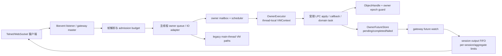
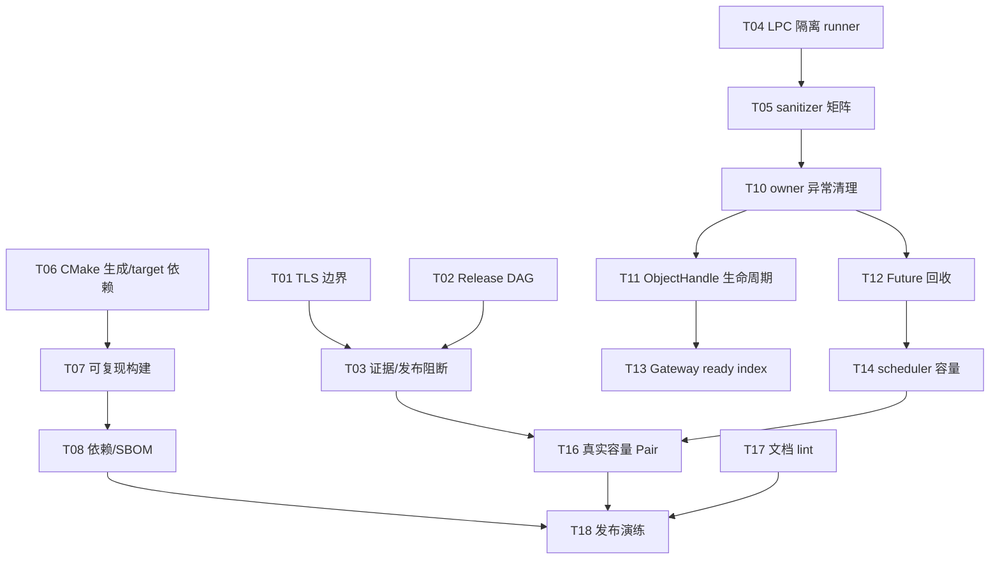

# FluffOS_XK 代码库深度审计与可执行改进方案

> 审计日期：2026-08-09（Asia/Shanghai）
>
> 审计基线：`master` / `24bd5f4f5126963966d1d91787f327f4cc84a5e7`（`parser: bound debug output formatting`）
>
> 工作区：`/home/mechrevo/projects/fluffos-src`
> 审计性质：只读代码库学习、结构审计、定向构建与测试；本次交付只新增本文件，不修改源码，不提交、不推送、不部署。

## 1. 先给结论

FluffOS_XK 的运行时演进方向是清晰的：传统 LPC driver、事件循环和全局对象系统之上，已经建立了 `VMContext`、owner metadata、owner mailbox、OwnerExecutor、ObjectHandle、frozen payload、future 和 gateway 任务合同。代码中也有较完整的 stale/epoch/destructed 防线、有限队列和运行时计数器。就“架构意图和局部实现能力”而言，项目基础较强。

但当前不能把仓库描述为“所有生产风险已关闭”或“当前 checkout 已证明生产容量”。本次审计发现两个必须先处理的阻断项，以及多项高可信工程风险：

1. **P0 安全缺陷：** `sys_reload_tls()` 的数组边界检查使用字节数、错误的比较符，并在校验后直接索引，存在越界访问路径。
2. **P0 发布治理缺陷：** release workflow 在构建和测试前先推送 tag、创建正式 release；Linux 测试还被 `|| true` 忽略，失败或未验证的二进制可能被公开发布。
3. **P1 质量与证据风险：** sanitizer 只有 ASan，UBSan 被注释且没有 TSan；CMake 生成文件会回写源码树；文档中的 commit/报告路径和当前 checkout 漂移；测试夹具固定端口导致完整 LPC testsuite 当前退出码为 1。
4. **P1/P2 运行时风险：** owner executor 缺少顶层异常边界；`add_vmessage()` 存在精确长度边界问题且使用静态共享缓冲；object store 仍保留全局 bridge；gateway 输出扫描按 session 全量遍历；future terminal record 依赖调用方 `take()`，缺少明确的生命周期上限。
5. **P2 供应链和运维风险：** 大量 vendored 依赖缺少统一 manifest/SBOM/更新策略；release 中的 jemalloc 下载未做校验和验证；测试仓库包含长期有效的自签名私钥 fixture；安全报告没有直接渠道。

**当前建议的决策：** 先修复 P0 并建立可阻断的质量门禁，再进行任何性能结构优化或生产发布。性能优化必须以可重复的 workload、commit、编译配置和平台指纹为前提；短时 smoke 通过不能替代长时容量证据，也不能替代真实 300-player Pair。

## 2. 风险分级与证据等级

### 2.1 风险分级

| 等级 | 定义 | 当前处理要求 |
| --- | --- | --- |
| P0 | 可直接导致越界、错误发布、远程/本地高影响故障，或使其他门禁失去意义 | 立即修复；未关闭前禁止正式发布 |
| P1 | 高概率造成稳定性、扩展性、可维护性或安全治理问题 | 近期迭代完成；需要自动化验收 |
| P2 | 中长期容量、成本、文档、供应链或体验风险 | 纳入路线图；先测量再决定实现规模 |
| P3 | 改进项或低风险技术债 | 结合日常维护处理 |

### 2.2 证据等级

| 证据 | 含义 | 本文写法 |
| --- | --- | --- |
| A：已确认 | 当前源码、当前配置或当前命令输出直接证明 | “已确认” |
| B：高可信风险 | 代码路径和设计推理显示风险，但尚未完成针对性复现或规模测试 | “高可信风险/需要验证” |
| C：未验证 | 需要外部环境、真实 mudlib、长时运行、特定平台或生产数据 | “尚未验证；不能下结论” |

历史文档、历史 benchmark 或交接记录只能作为背景，不自动升级为当前基线的 A 级证据。任何 `production-ready`、`completed` 或 `ready` 字段都必须绑定当前 commit、配置、workload、时间和可重跑命令。

## 3. 审计范围、方法与环境

### 3.1 范围

本次覆盖：

- `src/`：driver 主循环、VM、compiler、base、network、packages、owner/runtime、object store、gateway。
- `src/tests/` 与 `testsuite/`：C++/GoogleTest、LPC 层测试、测试 driver 配置和 TLS fixture。
- `CMakeLists.txt`、`src/CMakeLists.txt`、`cmake/`：配置选项、生成文件、目标依赖和增量构建行为。
- `.github/workflows/`、`Dockerfile`：CI、静态分析、Docker、release、依赖下载和发布顺序。
- `README*`、`docs/`、`SECURITY.md`、性能报告：架构叙述、验收门禁、证据新鲜度、链接和运维说明。

本次不包含：

- 对源码、配置、CI 或正式文档的修复性修改（除本文件）。
- 对 `/home/mechrevo/projects/XiaKeXing` 当前 checkout 的重新审计或真实线上部署。
- 真实生产流量、真实 300-player Pair、跨主机故障演练；这些列为外部前置条件。

### 3.2 方法

1. 先检查分支、HEAD、工作区和已有变更，避免覆盖并行工作。
2. 读取项目知识地图、runtime/gateway/object/future 入口，再按符号和调用链定位实现。
3. 对边界、线程归属、生命周期、错误传播、队列和 fallback 做源代码审阅。
4. 执行当前构建目录的 CTest、独立 ASan CTest、runtime smoke，并重新运行 LPC testsuite 以确认可重复性。
5. 将当前结果与历史 production 文档区分，记录无法由当前环境证明的项目。

### 3.3 环境和仓库事实

| 项目 | 当前值 |
| --- | --- |
| OS | WSL2 Linux 6.6.87.2，x86_64 |
| CMake | 3.28.3 |
| GCC | g++ 13.3.0（Ubuntu 24.04） |
| 本地 Clang | 当前 shell 未提供 `clang++`，未做本地 Clang 复验；CI 有 Clang 矩阵 |
| CPU 逻辑核 | 32 |
| 分支 | `master`，跟踪 `origin/master` |
| 工作区 | 审计开始时 clean：`## master...origin/master` |
| tracked files | 约 3998 |
| `src` tracked files | 约 2467 |
| `docs` Markdown | 约 956 |
| 测试文件 | 约 434 |
| `src/thirdparty` tracked files | 2137 |

### 3.4 已执行命令与结果

| 命令/报告 | 结果 | 证据等级与边界 |
| --- | --- | --- |
| Debug CTest（构建目录 `build`） | `392/392 tests passed`，总耗时约 19.87 秒 | A；证明当前 C++ 单测集合通过，不证明长时容量 |
| ASan CTest（`build-audit-asan`，RelWithDebInfo、`ENABLE_SANITIZER=ON`、LTO/native off） | `392/392 tests passed` | A；只覆盖 AddressSanitizer 当前 CTest 集合 |
| `tools/lpc-modern-runtime-stress.sh smoke` | 退出码 0，生成 3 个 JSON 报告 | A；诊断 benchmark/smoke，不是生产容量证明 |
| LPC testsuite | LPC 断言到 `Checks succeeded.`，随后 Driver 因 `4000` 等固定端口冲突退出码 1 | A；不能宣称完整 testsuite 全绿 |
| 300-player Pair（`single_thread -> owner_thread_full`，长时） | 本次未执行 | C；不得写入“已证明” |

runtime smoke 报告路径：

- `build/reports/owner_runtime_bench_smoke.json`
- `build/reports/lpc_vm_bench_smoke.json`
- `build/reports/object_store_bench_smoke.json`

LPC 失败尾部原文：

```text
Checks succeeded.
Accepting telnet connections on 0.0.0.0:4000.
init_user_conn: bind error: Address already in use.
```

测试日志中的 `query_temp` 等预期 crasher 错误必须在测试治理时与真正的 Driver 初始化失败分开标记。

## 4. 仓库与运行时架构地图

### 4.1 顶层模块

| 层 | 关键路径 | 责任与边界 |
| --- | --- | --- |
| 进程入口/生命周期 | `src/main.cc`、`src/mainlib.cc` | 解析配置、初始化 driver、关闭顺序 |
| 事件循环 | `src/backend.cc` | libevent/backend、gametick、heartbeat/callout、主线程 queue drain |
| 传统连接 | `src/comm.cc` | telnet/interactive、输入、消息缓冲和传统命令路径 |
| Gateway | `src/packages/gateway/` | master/session、协议帧、future watch、输出 FIFO、现代入口 |
| VM/解释器 | `src/vm/` | svalue、apply、program、eval/error、对象和上下文 |
| Owner runtime | `src/vm/internal/owner.cc`、`owner_executor.*`、scheduler/future/trace store | owner 归属、mailbox、线程执行、stale guard、future 终态 |
| Object store | `src/vm/internal/object_store.cc`、`src/vm/object_handle.h` | owner-local shard、索引、tombstone、global bridge |
| Compiler | `src/compiler/` | lexer/parser/icode/program 生成；Bison 生成文件参与构建 |
| Packages | `src/packages/core`、`async`、`sockets`、`gateway` 等 | efun 和 callback 适配层 |
| 外部依赖 | `src/thirdparty/`、系统库 | libevent、libwebsockets、libtelnet、fmt、json、ICU、OpenSSL 等 |
| 测试/文档 | `src/tests`、`testsuite`、`docs` | C++ contract、LPC 回归、架构/发布说明 |

### 4.2 主要数据流



当前架构的关键事实：主线程仍维护传统 VM 全局状态；worker/owner thread 绑定独立 `VMContext`，普通 legacy LPC 默认关闭，只有显式 allowlist、same-owner/owner-domain、frozen payload 或 ObjectHandle 合同的任务才进入 executor。主线程 queue 仍是 IO、清理和显式兼容 fallback 的边界，不能把“任务进入 owner queue”写成“已经后台并行”。

### 4.3 并发和资源边界

| 边界 | 当前实现 | 审计判断 |
| --- | --- | --- |
| owner worker 数 | `vm_owner_thread_start()` 最多 4 个（`src/vm/internal/owner.cc:5465-5469`） | A；是当前支持矩阵约束，不是隐藏 bug |
| 单 owner mailbox | 最大深度 4096（`owner.cc:41-43`、入队检查） | A；有界设计，但需要资源耗尽验收 |
| executor 单次预算 | 32 个任务 | A；需要验证长任务和公平性 |
| trace store | 每类保留上限约 256 条 | A；需要明确丢弃策略和 oldest age |
| gateway session | 默认最大约 4096 | A；输出 flush/pending 仍遍历 session registry |
| gateway master | 默认最多 16 | A；外部 bind 被明确拒绝 |
| packet size | 默认 1 MiB，绝对上限 16 MiB | A；需和反向代理/客户端预算一致 |
| Object store | owner-local shard + global record/live-object bridge | A；尚非完全独立 owner-local store |
| Future terminal record | `poll/state` 保留记录；终态由 `take` 消费 | A；公共调用方的滞留上限仍需治理 |

## 5. 已确认问题清单

| ID | 优先级 | 状态 | 影响面 | 关键证据 |
| --- | --- | --- | --- | --- |
| F-001 | P0 | 已确认 | 安全/稳定性 | `src/packages/core/sys.cc:52-60` |
| F-002 | P0 | 已确认 | 发布/供应链 | `.github/workflows/release.yml:75-100,155-185` |
| F-003 | P1 | 已确认 | 测试/CI | `src/CMakeLists.txt:82-90`、`.github/workflows/ci.yml:57-75` |
| F-004 | P1 | 已确认 | 构建/可维护性 | `src/CMakeLists.txt:54-56,239-253,323-327,620-625` |
| F-005 | P1 | 已确认 | 证据/文档 | `docs/project-knowledge-map.md:23-27`、`docs/multicore-production-gate.md:88` |
| F-006 | P1 | 已确认设计边界、治理不足 | 网络安全/运维 | `src/packages/gateway/gateway.cc:50-52,2117-2123`、`SECURITY.md:3-17` |
| F-007 | P1 | 已确认夹具问题 | 测试可重复性 | `testsuite/etc/config.test:14-23` |
| F-008 | P1/P2 | 高可信风险 | 运行时稳定性 | `src/vm/internal/owner_executor.cc:5-15` |
| F-009 | P1/P2 | 高可信风险 | 消息正确性/线程安全 | `src/comm.cc:902-924` |
| F-010 | P2 | 高可信风险 | Gateway 扩展性 | `src/packages/gateway/gateway_session.cc:2718-2753` |
| F-011 | P2 | 高可信风险 | Object store 扩展性 | `src/vm/internal/object_store.cc:1516-1630` |
| F-012 | P2 | 高可信风险 | Future 资源生命周期 | `src/vm/internal/owner_future_store.cc:39-78,202-209` |
| F-013 | P2 | 高可信风险 | 依赖/供应链 | `src/thirdparty/`、`release.yml:169-173` |
| F-014 | P2 | 已确认治理缺口 | 测试秘密/运维 | `testsuite/etc/key.pem`（仓库 tracked、权限 0644） |

### 5.1 F-001：`sys_reload_tls()` 数组越界（P0）

**现状。** `external_port` 在 `src/base/internal/external_port.h:63` 声明为长度 5 的数组。`f_sys_reload_tls()` 将用户传入的 1-based 参数减一，然后用 `sizeof(external_port)` 和 `>` 做检查：

```cpp
auto port_index_display = sp->u.number;
auto port_index = port_index_display - 1;
if (port_index < 0 || port_index > sizeof(external_port)) {
  error("Invalid port index ...");
}
auto *port = &external_port[port_index];
```

`sizeof(external_port)` 是字节数而不是元素数，且合法上界应使用 `>=`。因此 `sys_reload_tls(6)` 会访问 `external_port[5]`；更大的若干索引也可能绕过当前检查。极小整数还可能在减一时触发有符号算术边界问题。该 efun 在 `src/packages/core/core.spec:381` 对 LPC 暴露，当前没有从源码确认独立权限检查。

**影响。** 越界读取/未定义行为、崩溃和潜在 Driver DoS；若不可信 mudlib 或管理脚本能调用该 efun，影响面会扩大。当前测试只覆盖普通索引，未覆盖 0、5、6、负数和极大值。

**整改。** 先校验 1-based 参数，再转换；使用 `std::size(external_port)` 或显式常量；把失败路径统一为可捕获 LPC error；补权限模型说明和回归测试。不要用“增大数组”掩盖边界错误。

**最小验收。** 参数 `0, -1, 1, 5, 6, INT64_MAX` 均不越界；合法 TLS 端口仍能 reload；ASan/UBSan 不报错；普通无权限对象按预期拒绝（若产品策略要求权限）。

### 5.2 F-002：Release 在验证前创建 tag/release（P0）

**现状。** `.github/workflows/release.yml` 的 `create-release` job 在 75-81 行先创建并推送 tag，在 83-100 行创建 `draft: false` 正式 release；构建 job 直到 102 行以后才开始。Linux 构建中 181-182 行使用 `make test || true`，静态链接检查也使用 `ldd ... || echo`，失败不会阻断 job。Linux job 没有运行完整 LPC testsuite，也没有统一的报告、SBOM、签名或 provenance gate。Docker 发布在另一条 workflow 中可由 master push 触发，当前没有明显依赖主 CI 的 required check。

**影响。** 构建失败、测试失败、错误架构或依赖不完整时，仓库仍会留下公开 tag/release；后续资产可能被用户自动拉取。版本号冲突、重跑和回滚也会变复杂。

**整改顺序。** 将流程改为：版本候选 -> 全平台构建 -> CTest/LPC/smoke/链接检查 -> SBOM/漏洞扫描/签名/attestation -> 上传临时 artifact -> 人工或策略批准 -> 创建 tag -> 创建 draft release -> 上传并校验资产 -> 发布正式 release。任何 gate 失败都不创建正式 tag/release。删除 `|| true`，让测试失败成为失败；将静态链接检查改成显式断言而非反向打印。

**最小验收。** 在 dry-run 中故意让一个测试失败，远端不存在 tag/release；所有 artifact 的 SHA256、commit、平台和构建配置一致；只有 required checks 全绿时才允许 `draft: false`。

### 5.3 F-003：Sanitizer 覆盖不足（P1）

`src/CMakeLists.txt:82-90` 仅启用 AddressSanitizer，UBSan 配置被注释，没有 TSan；CI 的 sanitizer matrix 只切换 `-DENABLE_SANITIZER=ON`，主要跑 CTest。源码注释与 CI 同时存在 Debug、RelWithDebInfo sanitizer 矩阵，政策不一致。owner executor、gateway callback、future、ObjectHandle/object store 的竞态、未定义行为和长时资源增长没有独立矩阵。

**整改方向。** 建立 ASan、UBSan、TSan 三条不同用途的 gate：

- ASan：完整 CTest、LPC contract subset、短 runtime smoke、断线/销毁路径。
- UBSan：边界整数、解析、数组/对象索引、协议长度和 JSON depth。
- TSan：缩小任务集，覆盖 owner claim、future store、gateway completion notifier、output FIFO、object store lock/bridge。

明确 sanitizer 构建类型、编译器、运行时库、超时和报告保存策略；不要把 sanitizer 通过当作生产性能数据。

### 5.4 F-004：CMake 生成污染与增量构建不稳定（P1）

已确认的构建问题：

- `include_directories()` 和全局 `link_libraries()` 较多，目标边界不清晰。
- `file(GLOB ALL_SPEC_FILES ...)` 未使用 `CONFIGURE_DEPENDS`，新增 spec 可能不会触发重新配置。
- `include_directories(SYSETEM ...)` 拼写错误，意图中的 SYSTEM 语义不可靠。
- Bison 生成文件在 `driver` POST_BUILD 阶段复制回 `src/compiler/internal/`（620-625），构建会修改源码树。
- 大量生成/聚合目标导致无源码变更时仍可能重复触发 `lex.cc`、`lpc_tests`、`driver` 等重编译。

**整改方向。** 生成物只留在 build tree；使用显式源列表或 `CONFIGURE_DEPENDS`；修正 `SYSTEM`；将 include/link requirement 改为 target-scoped `target_include_directories`/`target_link_libraries`；用 configure fingerprint 固定选项。将“第二次无改动构建零重编译、源码树 mtime 不变”纳入 CI。

### 5.5 F-005：文档、源码和性能证据漂移（P1）

`docs/project-knowledge-map.md:23-27` 仍写旧 HEAD `6e6f60e9`，当前 HEAD 是 `24bd5f4f`。`docs/multicore-production-gate.md:88` 引用了当前不存在的 `docs/reports/multicore-mudlib-audit-2026-06-25.md`。多核文档大量使用 2026-06 历史压力和 final audit 结论，而本次 checkout 的当前验证只有短 smoke；三个 smoke JSON 也没有统一记录 commit SHA、编译器、配置 hash、workload 版本、时间戳和平台指纹。

**影响。** 读者可能把历史证据误认为当前证据；`production_gate_ready=1` 等字段失去可复验含义，审计和发布决策会建立在错误基线上。

**整改方向。** 建立 evidence manifest 和文档 lint：每份报告必须包含 `schema`、`run_id`、`commit_sha`、`build_config_hash`、`compiler`、`platform`、`workload_version`、`started_at`、`ended_at`、命令和 cleanup 状态；文档链接、commit、日期和报告路径自动检查；正文显式区分 `historical`、`current`、`external-required`。强表述必须引用当前 manifest 中的 gate。

### 5.6 F-006：Gateway master transport 的信任边界未产品化（P1）

源码明确写出 master transport 未认证、未加密，并将 `kGatewayExternalBindAllowed` 固定为 `false`（`gateway.cc:50-52`）；`gateway_listen_internal()` 在 `bind_all` 时拒绝外部绑定并提示使用受保护代理（2117-2123）。这是保守且合理的安全选择，但配置和运维文档仍可能让用户误以为 `gateway external` 可安全开放。

**整改方向。** 启动日志明确打印 loopback-only；配置解析阶段对外部地址直接报错并给出代理/TLS 方案；文档列出禁止的部署方式；增加外部绑定拒绝测试和代理连接示例。若未来要开放跨主机 master，必须另立协议认证、加密、密钥轮换、重放保护和兼容性项目，不能只改一个布尔值。`SECURITY.md:3-17` 还需要直接安全报告渠道和支持版本策略。

### 5.7 F-007：LPC testsuite 固定端口破坏可重复性（P1）

`testsuite/etc/config.test:14-23` 固定绑定 `0.0.0.0:4000`、4001、4002、4003，且使用仓库内证书和私钥。并行任务、残留 Driver 或本机其他服务会导致 bind error；`mud ip : 0.0.0.0` 还会把测试 listener 暴露到所有接口。

**整改方向。** 提供 `tools/testsuite/run-isolated.sh`：为每次运行创建临时 mudlib/log 目录，自动分配空闲端口，渲染临时 config，使用 `trap` 保证 Driver 和 listener 清理；默认绑定 loopback；保留固定端口只作为显式兼容模式。测试 TLS 证书在运行时生成或明确标记为非生产 fixture，并禁止把 fixture 路径带入发布包。

### 5.8 F-008：OwnerExecutor 顶层异常和清理边界（P1/P2）

`src/vm/internal/owner_executor.cc:5-15` 的 `run()` 绑定 context 后循环 claim、run、release，没有顶层 `try/catch` 或分类错误处理。`owner.cc` 的部分具体任务有局部 catch，但不能由此证明所有 callback、分配失败和意外 C++ exception 都会被捕获。

**潜在影响。** 未处理异常可能终止 worker 线程或整个进程；owner claim、引用、VMContext、future 和 deferred cleanup 可能停在中间状态。当前尚未用注入异常或 `bad_alloc` 复现，因此这是 B 级高可信风险，不应直接写成已发生崩溃。

**整改方向。** 在 executor runtime 定义异常分类和清理协议：任务级异常转为 failed future/trace，释放 owner claim 和目标引用；不可恢复错误触发受控 shutdown；`std::exception`、未知异常和内存分配失败分别计数。使用 RAII guard 保证 `release_owner_after_task`、`release_owner_task_target`、VMContext cleanup 在所有路径执行。

### 5.9 F-009：`add_vmessage()` 的长度边界与共享缓冲（P1/P2）

`src/comm.cc:902-924` 使用 `static char buf[LARGEST_PRINTABLE_STRING + 1]`。`vsnprintf` 的返回值不含 NUL，当 `result == sizeof(buf)` 时实际写入内容已被截断到 `sizeof(buf)-1` 字节，但代码仍以 `result` 作为发送长度（913-914），可能多发送一个 NUL并丢失一个字符。静态缓冲还需确认是否可能从多个 owner worker/回调并发到达；当前调用链没有用 TSan 完成证明。

**整改方向。** 将短路径判定改为严格 `< sizeof(buf)`；边界等于、超出、负返回值都加测试。若该函数可能跨线程调用，改为线程局部缓冲或使用局部 `std::string`/RAII buffer；若契约要求只在主线程调用，则在入口断言并写入文档。

### 5.10 F-010：Gateway 输出 FIFO 的 O(session) 扫描（P2）

`gateway_flush_master_output_fifos()` 和 `gateway_master_output_pending()`（`gateway_session.cc:2718-2753`）每次遍历 `g_gateway_sessions`，再按 master fd 和 ready 状态筛选。默认最多 4096 session 时，写回调或定时 flush 可能产生重复扫描；`gateway_check_session_timeouts()` 也有周期性 registry 扫描。

这是待测的扩展性假设，不是已证明瓶颈。先增加扫描次数、耗时、命中率和 ready 数计数，再用 1K/4K/16K session、不同 ready 稀疏度和慢 peer 测量。只有数据证明扫描占用显著 CPU 或尾延迟，才引入按 master 的 ready queue/index；迁移时必须保持 FIFO、断线移除、预算和背压语义。

### 5.11 F-011：Object store global bridge 的规模风险（P2）

`vm_object_handle_resolve_status()` 先尝试 owner-local shard，但在 stale/cross-owner/bridge readiness/status 路径仍可能在 shared lock 下查询全局记录、owner shard 和索引（`object_store.cc:1516-1630`）。当前 object store smoke 只有 32 个对象且 global fallback 为 0，不能外推到 1K/10K/100K 对象。

**整改方向。** 增加规模阶梯 benchmark，记录 global fallback、扫描次数、shared-lock wait、resolve p50/p95/p99 和迁移/destruct 吞吐；将一致性扫描移到后台诊断，热路径只读取预计算 readiness/version。只有在数据支持时再物理退休 global bridge，且保留可回滚开关和双向一致性检查。

### 5.12 F-012：Future terminal record 的滞留上限（P2）

`OwnerFutureStore::poll()` 只复制记录，不消费；`take()` 仅在终态时删除（`owner_future_store.cc:39-78`）。store 暴露 `size()`，但当前未见统一 TTL、最大终态数量或 oldest-age 回收策略。Gateway watch 路径大多会 `take()`，但公共 efun/其他调用方可以持续 `poll/state` 而不 `take()`。

**整改方向。** 先通过静态调用图和运行时计数确认所有 watch 的消费路径，再定义所有权语义：调用方必须 take、或 store 对终态保留有限 TTL。增加 `terminal_record_count`、oldest age、bytes、reaped count、reap reason 和上限告警；资源耗尽时新提交应明确拒绝并返回可诊断错误，而不是无界增长。

### 5.13 F-013：依赖和构建供应链治理（P2）

`src/thirdparty` 有约 2137 个 tracked files，包含 fmt 10.1.0、nlohmann/json 3.11.2、libtelnet 0.30.0、libwebsockets 4.2.1 等版本。vendoring 本身不是漏洞，但当前没有统一的来源 URL、上游 commit/tag、许可证、补丁、漏洞状态和更新责任 manifest。release Linux 构建通过未固定校验和的 URL 下载 jemalloc 5.3.0（`release.yml:169-173`）。近期有第三方安全修复提交，不能把“治理缺失”误写成“已知漏洞”。

**整改方向。** 建立 `third_party/manifest.yaml` 或等价机器可读清单，记录版本、来源、校验和、许可证、补丁和最后审查日期；构建时使用锁定 checksum 或仓内源码；生成 SBOM（CycloneDX/SPDX），做 OSV/依赖扫描，并在升级前后跑 ABI/API、CTest、sanitizer 和静态链接检查。

### 5.14 F-014：测试私钥 fixture 和安全报告渠道（P2）

`testsuite/etc/key.pem` 是 tracked 的自签名测试私钥，权限为 0644，证书有效期跨越多年。当前看起来是测试 fixture，不应当当成生产泄露；但仓库扫描器和误复制风险仍然存在。`SECURITY.md` 明确没有直接安全联系人，只指向平台工具或上游策略。

**整改方向。** 优先改为测试运行时生成短期证书，或在 `SECURITY.md` 中明确 fixture 非生产、加入 secret-scanning 规则并限制打包；发布前检查安装包不含测试 key。建立私有安全报告邮箱/平台入口、响应时限、支持版本和撤回流程。

## 6. 做得好的地方与应保留的设计

审计不是只列问题。以下设计应作为后续重构的约束，而不是被回退：

- `VMContext` 把执行、对象 store、owner、error/eval 状态逐步从线程共享全局状态收敛到线程本地上下文。
- owner id + epoch + ObjectHandle stale/destructed guard 为跨线程目标提供了明确的失败语义。
- ordinary legacy LPC 默认关闭、显式 allowlist 和 frozen payload 降低了无意跨 owner 可变访问的风险。
- owner mailbox、executor budget、gateway packet/output FIFO 上限为资源耗尽提供了边界。
- runtime status、task/access/message/commit trace 和 counter 让很多合同可以被机器读取；后续应补证据新鲜度和 retention 语义，而不是删除观测。
- C++ contract 测试覆盖了 gateway 输入输出边界、FIFO、future 终态、stale epoch、owner scheduler、VMContext、对象生命周期和受控关闭等路径。
- gateway 已明确拒绝未经认证/加密的 external bind，未来应把这个安全意图变成配置、日志和文档的统一产品行为。

## 7. 分维度审计结论

### 7.1 代码质量

**优点：** C++17/C11 标准固定；owner runtime 已抽为多个内部编译单元；合同字段和错误状态有较多命名化表达；测试中有较细的 stale、epoch、destruct、queue 和 future 场景。

**主要问题：** 全局可变状态和 global bridge 仍然较多；CMake 全局 include/link 使依赖边界不透明；生成代码回写源码树；同一类 mapping/contract 字段在多处手工组装，容易出现字段漂移；异常和裸 `object_t*` 生命周期契约不够显式；部分边界测试由普通值覆盖，缺少极值和故障注入。

**目标质量门禁：** 编译器警告零新增；clang-format/clang-tidy 只在变更文件或增量范围执行；禁止新增裸跨线程 object pointer API；每个新 task descriptor 必须有 payload、ownership、stale、failure、cleanup、trace 和 test 条目；复杂度和锁等待超过基线必须有报告。

### 7.2 项目架构

当前架构采用“主线程兼容面 + owner executor 受限并行面”的渐进式迁移，适合保护传统 LPC 语义；风险在于 adapter、fallback 和 bridge 可能长期成为隐形单点。后续必须把每条路径标为：`executor-safe`、`main-required`、`explicit-fallback` 或 `rejected`，并让 trace/status 与文档使用同一枚举。

Object store 尤其需要分清：owner-local lookup/resolve 已具备、global bridge retirement 是否完成、global object table 是否仍是 canonical source。这三件事不能用一个 `ready=1` 代替。

### 7.3 性能与扩展性

当前 smoke 的可复核数值包括：

| 场景 | 当前 smoke 观察值 |
| --- | ---: |
| 不同 owner、4 worker 吞吐 | 721 task/s |
| service shard、4 worker 吞吐 | 726 task/s |
| same-owner claim conflict | 0 |
| executor queue depth（结束时） | 0 |
| future pending backlog（结束时） | 0 |
| ObjectHandle global fallback | 0 |
| object resolve p95（32 对象） | 100 ns |
| apply dispatch cache hit | 518 |
| dispatch apply/direct call | 60/24 ns per call |
| representative LPC CPU | 578595 ns/iteration |

这些数字只说明本次诊断 workload 在当前机器和配置下没有立即失败。它们没有覆盖真实玩家行为、网络抖动、慢 peer、数据库、长时内存、1K+ 对象、4096 session、owner worker 上限以外的机器，也不能证明 300-player Pair。任何优化任务都必须先保存基线报告，再比较同一 workload 的 p50/p95/p99、吞吐、CPU、RSS、锁等待、队列峰值和错误增量。

### 7.4 安全

风险面包括：LPC 可调用 efun 的权限边界、网络 listener 绑定、协议长度/JSON 深度、输出 FIFO 资源耗尽、对象/future 生命周期、测试秘密、第三方依赖和发布凭据。当前已有 packet 上限、JSON depth、loopback-only、stale guard 和 CodeQL workflow，但没有完整的 threat model、SBOM、锁定下载、直接安全报告渠道和 release provenance。

### 7.5 测试与验证

CTest 当前很强，但测试金字塔仍不完整：

- 单元/合同：392/392 通过，覆盖面好。
- LPC：断言通过到 `Checks succeeded`，但夹具初始化失败，退出码 1。
- Runtime smoke：有结构化 JSON，规模和时长小。
- 端到端：当前 checkout 没有真实 gateway/mudlib 长时证据。
- Fuzz/故障注入：尚未形成稳定 gate。
- Sanitizer：ASan 有，UBSan/TSan 缺失。

因此“测试绿”必须细分为 CTest green、LPC harness green、runtime smoke green、E2E/capacity green，禁止只报一个总状态。

### 7.6 构建系统

默认 `MARCH_NATIVE=ON` 和 LTO 在 Release/RelWithDebInfo 开启，会提高本机性能但降低可移植性和复现性；CI/release 对部分平台关闭，开发者本地可能得到不同二进制。全局选项、vendored 子项目和源码树生成物增加了 cache invalidation 和污染风险。应把“portable release”“developer native”“sanitizer debug”设成命名 profile，并记录完整 configure 命令与 hash。

### 7.7 CI/CD 与发布

CI 有 Ubuntu GCC/Clang、macOS、Windows、ASan matrix，也运行 LPC testsuite；但 docs-only 变更被 `paths-ignore`，sanitizer 不含完整 runtime/LPC 场景，Coverity token 缺失时只 notice/skip，Docker 发布未明显依赖主 CI，release 先发 tag/release。发布 DAG 需要重新设计为 artifact-first、gate-first、tag-last。

### 7.8 文档与可维护性

文档数量多、架构信息丰富，这是优势；但知识地图和 production gate 文档已经出现 commit/path/历史证据漂移。文档应由机器生成或 lint 关键事实，而不是依赖人工搜索替换。每份“完成”表述要附证据 ID、SHA、时间和失效条件。

## 8. 目标状态与设计原则

### 8.1 不可妥协的原则

1. **边界先于优化：** 所有跨线程对象、future、callback 和输出都必须有明确 owner、epoch、引用、失败和清理协议。
2. **证据先于发布：** 任何 tag、release、Docker push 都必须发生在所有必需 gate 通过之后。
3. **可重复先于比较：** benchmark 必须锁定 commit、编译器、配置、平台、workload、随机种子和时间。
4. **默认拒绝：** 未认证 transport、未 allowlist 的 LPC、未知 payload 类型和超限资源请求默认拒绝并可诊断。
5. **主线程适配器显式化：** main-required 不等于失败；但必须标记、计数、设上限，并不能悄悄扩大。
6. **回滚可行：** 每个迁移先保留旧路径的 feature flag 或兼容读路径，等双向一致性和容量 gate 通过后再退休。

### 8.2 目标运行时合同

| 合同 | 必须回答的问题 | 目标验收 |
| --- | --- | --- |
| task descriptor | 任务能否后台执行？需要什么上下文？ | `dispatch_kind/executor_safe/main_required/rejected` 与 trace 一致 |
| payload | 是否可跨 owner 共享？谁拥有内存？ | frozen/immutable 或显式 clone；无裸可变引用 |
| target handle | 目标是否仍 current？ | id/path/owner/epoch/destructed 原子诊断 |
| future | 谁消费？终态保留多久？ | pending/terminal/consumed、TTL/上限和 oldest age 可观测 |
| cleanup | 失败、断线、取消、shutdown 怎么释放？ | RAII + 注入故障测试，引用和 queue 回到零 |
| fallback | 何时回主线程？是否算正常路径？ | 显式计数，正常路径 fallback=0 或有批准预算 |
| evidence | 结论何时失效？ | manifest 绑定 SHA/config/workload/time/platform |

## 9. 分阶段执行路线图

| 阶段 | 时间建议 | 目标 | 必须完成的工作包 | 退出条件 |
| --- | --- | --- | --- | --- |
| Phase 0：止血 | 0-2 个工作日 | 关闭发布和安全阻断 | T01、T02、T03 | P0 修复已进入门禁，release 不再先发 tag |
| Phase 1：可重复验证 | 第 1 周 | 让 CTest/LPC/sanitizer 结果可信 | T04、T05、T06 | LPC harness 在隔离环境退出 0；ASan/UBSan 基线可重跑 |
| Phase 2：构建和供应链 | 第 2-3 周 | 让二进制可复现、依赖可追踪 | T07、T08、T09 | 第二次构建零重编译；SBOM/checksum/provenance 生成 |
| Phase 3：运行时生命周期 | 第 3-5 周 | 收口异常、对象/future/回调资源 | T10、T11、T12 | 注入故障无 claim/ref/context/future 泄漏 |
| Phase 4：规模测量与优化 | 第 5-8 周 | 用数据决定索引和 worker 扩展 | T13、T14、T15 | 1K/4K/16K session、1K/10K/100K object 报告齐全 |
| Phase 5：生产验收 | 第 8 周起 | 真实链路和发布演练 | T16、T17、T18 | 外部 300-player Pair 或明确的容量上限证据通过 |

时间是建议值，不是完成承诺；任何阶段遇到停止条件都应回退到诊断状态。

## 10. 详细可执行工作包

下面每个工作包都包含目标、文件、前置条件、步骤、命令、验收和回滚。命令中的 `<...>` 是执行者需要填写的已确认路径或环境变量，不应凭猜测替换。

### T01：修复 `sys_reload_tls()` 边界并建立权限合同（P0）

**目标**：消除越界访问和整数边界风险，明确调用权限。

**目标文件**：

- `src/packages/core/sys.cc`
- `src/base/internal/external_port.h`
- `src/packages/core/core.spec`
- `src/tests/test_lpc.cc` 或现有 core efun contract 测试文件
- `testsuite/single/tests/efuns/` 下新增边界 fixture（如适用）

**前置条件**：确认 external port 的产品索引是 1-based；确认普通 mudlib 是否允许调用该 efun；不要在未确认权限模型时擅自加入不可逆访问限制。

**实施步骤**：

1. 在减一前检查 `display < 1 || display > element_count`，元素数使用 `std::size(external_port)`。
2. 统一错误信息和 LPC 可捕获行为；避免先计算可能溢出的 `display - 1`。
3. 添加边界表驱动测试：`INT_MIN`、`-1`、`0`、`1`、`5`、`6`、`INT_MAX`/LPC 最大整数。
4. 对合法 TLS port 做一次成功 reload；对 undefined、websocket、非 TLS 端口验证原有错误语义不变。
5. 记录是否需要 master/privileged caller 检查，并同步 `core.spec` 与安全文档。

**验证命令**：

```bash
cmake --build build --target driver lpc_tests -j2
ctest --test-dir build --output-on-failure
cmake --build build-audit-asan --target driver lpc_tests -j2
ctest --test-dir build-audit-asan --output-on-failure
```

**验收指标**：

- 所有非法输入在进入数组前被拒绝；ASan/UBSan 无报告。
- CTest 和 LPC 边界 fixture 退出码为 0。
- 合法 reload 行为与基线一致，错误字符串可诊断。
- 权限规则在代码、spec、文档和测试中一致。

**回滚**：保留旧 efun 行为的最小兼容分支，但不得恢复未修复边界；若合法配置回归，先关闭 reload feature flag，保留安全边界修复并回到上一已验证二进制。

### T02：重排 Release DAG，做到 artifact-first/tag-last（P0）

**目标**：任何未通过构建、测试、扫描和签名的结果都不能形成公开 release。

**目标文件**：`.github/workflows/release.yml`、可能新增 `.github/workflows/release-gates.yml`、`RELEASE.md`。

**前置条件**：确认 GitHub environment、发布审批人、签名密钥和包仓库权限；先用 fork/dry-run 验证，不在本次审计中触发远端副作用。

**实施步骤**：

1. `generate-version` 只生成候选版本，不写 tag。
2. `build-binaries`、Docker build、CTest、LPC testsuite、runtime smoke、静态链接检查并行运行。
3. Linux 构建中删除 `make test || true`，将 `ctest --output-on-failure` 和隔离 LPC harness 设为 required check。
4. 用 `file`/`readelf`/明确返回码验证静态链接，不用 `ldd ... || echo` 作为成功条件。
5. 生成 SBOM、SHA256 manifest、构建 provenance 和签名；下载 artifact 后再做一次 hash 校验。
6. 所有 gate 通过后才创建 tag，创建 `draft: true` release，上传并校验全部资产，最后由审批或策略转为正式 release。
7. Docker push 依赖同一组 required checks，禁止 master push 绕过安全门禁；失败重跑不得覆盖已有版本。

**验证命令（本地 workflow 逻辑检查）**：

```bash
rg -n "Create Git Tag|createRelease|draft:|make test|ctest|lpc|sha256|sbom|attest" .github/workflows/release.yml
actionlint .github/workflows/release.yml
```

**验收指标**：故意让测试 job 失败时，远端没有新增 tag/release；成功时每个资产有同一 commit SHA、构建配置和 hash；Docker tag 与 binary release 的 manifest 相同。

**回滚**：保留上一版已签名 release；若新 DAG 失败，停止发布 job，不删除历史 tag，不强推；修复 workflow 后从新的候选版本重跑。

### T03：补齐当前审计的证据登记和发布阻断（P0/P1）

**目标**：在源码修复完全落地前，避免文档或自动化把短 smoke 宣称为生产容量。

**目标文件**：`docs/multicore-production-gate.md`、`docs/project-knowledge-map.md`、新增 `docs/evidence/manifest.schema.json` 或等价格式、CI gate 脚本。

**实施步骤**：

1. 在当前文档中标注历史证据和当前 checkout 证据的边界。
2. 修正旧 HEAD、缺失报告链接和已失效日期；不能确认的字段改成 `unknown`/`external-required`。
3. 为所有 benchmark 报告增加必需元数据字段；缺失字段使 gate 失败。
4. 为 `production_gate_ready` 建立校验脚本：检查当前 SHA、报告存在、schema、时间、workload 和 cleanup。
5. 把“300-player Pair 未完成”写入 release checklist 和容量看板。

**验收指标**：链接和 commit lint 通过；历史报告不能单独使当前 gate ready；文档和机器字段在同一 manifest 上生成。

**回滚**：文档只回退到上一个可核验版本；不得恢复错误的“当前已完成”表述。

### T04：隔离并修复 LPC testsuite 测试夹具（P1）

**目标**：让测试可并行、可重跑、默认不暴露网络。

**目标文件**：`testsuite/etc/config.test`、新增 `tools/testsuite/run-isolated.sh`、必要的 config template 和 CI step。

**实施步骤**：

1. 复制 config 到临时目录，动态选择四个空闲 loopback 端口。
2. 将 `mud ip` 默认设为 `127.0.0.1`；允许显式 `--bind-all` 仅供专门网络测试。
3. 每次运行创建临时 `log`、状态和 socket 目录；使用 `trap` 清理 Driver、子进程和临时文件。
4. 捕获 Driver 退出码、LPC assertion summary 和预期 crasher 列表；三者分开报告。
5. TLS fixture 改为运行时生成短期证书，或将现有 key 明确排除在发布包和 secret 扫描误报之外。
6. CI 并行矩阵使用不同临时目录和端口，禁止共享 `4000-4003`。

**验证命令**：

```bash
tools/testsuite/run-isolated.sh --driver build/bin/driver --mode audit
tools/testsuite/run-isolated.sh --driver build-audit-asan/bin/driver --mode audit
```

**验收指标**：连续 5 次运行退出码均为 0；两个并行实例互不冲突；默认只监听 loopback；日志能区分 assertion、预期 crasher 和真实启动失败。

**回滚**：保留现有 `config.test` 作为显式 legacy fixture，但 CI 和发布 gate 只使用隔离 runner；若动态端口导致某个协议测试不稳定，先固定在临时 loopback namespace，不恢复全局公开 bind。

### T05：建立 ASan/UBSan/TSan 分层矩阵（P1）

**目标**：覆盖内存、未定义行为和数据竞争，不把三种 sanitizer 混成一个开关。

**目标文件**：`src/CMakeLists.txt`、`.github/workflows/ci.yml`、新增 sanitizer workflow/脚本、`tools/` 报告收集脚本。

**实施步骤**：

1. 将 sanitizer 配置拆成 `ENABLE_ASAN`、`ENABLE_UBSAN`、`ENABLE_TSAN`（或等价 preset），互斥检查不兼容组合。
2. 明确 Debug/RelWithDebInfo 政策，并在 CMake configure 输出完整 flag。
3. ASan 跑 392 CTest、隔离 LPC subset、runtime smoke、destruct/reconnect/slow-peer。
4. UBSan 增加极值输入、协议长度、TLS index、整数转换和 JSON depth。
5. TSan 使用较小任务集：owner claim/release、future store、gateway notifier、output FIFO、object store read/write lock。
6. 保存 sanitizer log、stack symbol、环境和报告 artifact；任一 sanitizer 报告都阻断对应 gate。

**验证命令示例**：

```bash
cmake -S . -B build-asan -DCMAKE_BUILD_TYPE=Debug -DENABLE_ASAN=ON -DENABLE_LTO=OFF -DMARCH_NATIVE=OFF
cmake --build build-asan -j2
ctest --test-dir build-asan --output-on-failure
cmake -S . -B build-ubsan -DCMAKE_BUILD_TYPE=Debug -DENABLE_UBSAN=ON -DENABLE_LTO=OFF -DMARCH_NATIVE=OFF
cmake -S . -B build-tsan -DCMAKE_BUILD_TYPE=Debug -DENABLE_TSAN=ON -DENABLE_LTO=OFF -DMARCH_NATIVE=OFF
```

**验收指标**：每个矩阵有明确测试清单和 artifact；未捕获的 sanitizer 输出为 0；出现失败时 CI 状态为失败而非 notice。

**回滚**：只回退新增矩阵，不关闭普通 CTest；保留已通过的 ASan gate，并记录未覆盖项为 `unknown`。

### T06：改造 CMake 生成和目标依赖（P1）

**目标**：避免源码树污染，提升增量构建、可移植性和依赖可见性。

**目标文件**：`src/CMakeLists.txt`、相关 `thirdparty/*/CMakeLists.txt`、`cmake/`。

**实施步骤**：

1. 把 Bison/lexer/efun/options 生成物全部输出到 `${CMAKE_CURRENT_BINARY_DIR}`；删除 POST_BUILD 回写源码目录。
2. 对 spec/header 源文件采用显式列表，或至少加 `CONFIGURE_DEPENDS` 并增加新增文件测试。
3. 修复 `SYSETEM`，删除重复/无效的 global include。
4. 将 `include_directories`、`link_libraries` 改成目标级 usage requirements；对 `libdriver`、`driver`、`lpcc`、tests 分别声明 PUBLIC/PRIVATE。
5. 建立 CMake preset：`dev-debug`、`portable-release`、`asan`、`ubsan`、`tsan`，记录 options hash。
6. 用 compile_commands 和依赖图检查不必要重编译。

**验证命令**：

```bash
cmake -S . -B build-cmake-audit -DCMAKE_BUILD_TYPE=Debug -DMARCH_NATIVE=OFF -DENABLE_LTO=OFF
cmake --build build-cmake-audit -j2
find src -newer build-cmake-audit/CMakeCache.txt -type f | sort
cmake --build build-cmake-audit -j2 --verbose
```

**验收指标**：第二次无改动构建不重新编译 C++ 源文件；源码树不产生/更新生成文件；新增 spec 后 configure 能检测到；各 target 的 include/link 依赖可从 CMake target graph 解释。

**回滚**：按模块逐步迁移；若某平台依赖失败，临时保留兼容 include 目录并加注释/issue，不恢复源码树 POST_BUILD 写回。

### T07：统一编译配置和可复现构建（P1/P2）

**目标**：让 developer native、portable release、sanitizer 三类二进制可区分且可复现。

**目标文件**：CMake presets、`RELEASE.md`、Dockerfile、CI workflow。

**实施步骤**：

1. portable release 默认 `MARCH_NATIVE=OFF`、固定编译器容器/镜像 digest、明确 LTO 状态。
2. 记录 `CMAKE_BUILD_TYPE`、包开关、编译器版本、系统库版本、git SHA 和 source date epoch。
3. 对相同输入做两次 clean build，比较可执行文件和安装包 hash；若无法 bit-for-bit，记录不可复现字段和原因。
4. 将 `-fno-omit-frame-pointer`、FORTIFY、stack protector 等安全 flags 写入 profile 文档。
5. 在 CI 上传 `CMakeCache.txt`、compile command 摘要和 build manifest。

**验收指标**：同一容器/同一 SHA 两次构建 hash 一致或差异可解释；跨平台资产不误标架构；开发者不会把 `-march=native` 产物当发布包。

**回滚**：保持旧 profile 只用于开发兼容，给它单独名称；发布始终使用 portable profile。

### T08：依赖 manifest、锁定下载和 SBOM（P2）

**目标**：建立可审计的第三方供应链。

**目标文件**：新增 `third_party/manifest.yaml`（或项目认可格式）、`src/thirdparty/` 元数据、release/CI workflow、`Dockerfile`。

**实施步骤**：

1. 为每个 vendored 库记录上游 URL、版本/tag/commit、许可证、checksum、项目补丁和责任人。
2. 将 release 中 jemalloc tarball 纳入仓内缓存或 checksum 校验；下载失败/校验失败必须退出。
3. 固定 Alpine 基础镜像 digest，建立镜像生命周期和升级窗口。
4. 生成 SPDX/CycloneDX SBOM，执行 OSV/Trivy 等扫描；扫描结果按严重度和豁免 ID 管理。
5. 对浮动 GitHub Action 建立 pinning/升级策略，至少记录 major、digest 和审查日期。

**验收指标**：release artifact 带 SBOM、依赖 manifest 和漏洞报告；任何未锁定下载导致 gate 失败；许可证清单完整；镜像 digest 可追溯。

**回滚**：保留上一版 manifest 和依赖 tarball；升级失败时回到上一已扫描版本，不删除当前源码中的兼容补丁。

### T09：安全策略、秘密 hygiene 和权限模型（P1/P2）

**目标**：把安全边界从注释和约定变成可执行策略。

**目标文件**：`SECURITY.md`、gateway 配置解析、`core.spec`/efun 权限入口、testsuite fixture、CI security workflow。

**实施步骤**：

1. 补充直接安全报告渠道、响应 SLA、支持版本和披露流程。
2. 为 `sys_reload_tls`、gateway admin/master、future cancel/take 等 efun 建立 caller/permission matrix。
3. 启动时打印 gateway loopback-only 和拒绝 external bind 的明确警告；配置阶段拒绝不安全组合。
4. secret scanning 将测试 key 改为动态生成或标记为专用 fixture；发布打包前检查无 `*.pem` 私钥。
5. 对 packet size、JSON depth、output FIFO、future watch、mailbox 深度做资源耗尽和拒绝测试。

**验收指标**：外部 bind 测试明确失败且无 listener；未授权 efun 测试得到预期拒绝；发布包不含测试私钥；安全报告入口可在新环境中验证。

**回滚**：安全拒绝策略只允许回退到 loopback/上一安全配置，不允许为兼容性重新开放未认证外部 transport。

### T10：OwnerExecutor 异常、取消和清理合同（P1）

**目标**：任何 task 失败都不会遗留 owner claim、引用、context、future 或 mailbox 状态。

**目标文件**：`src/vm/internal/owner_executor.cc`、`owner.cc`、`owner_future_store.*`、`owner_trace_store.*`、相关 C++ tests。

**实施步骤**：

1. 为 `run_claimed_owner` 和单 task dispatch 增加 RAII release/cleanup guard。
2. 分类处理 LPC error、`std::exception`、未知异常、`bad_alloc`；必要时将 task 转 failed future 并记录 reason。
3. 在异常前后记录 owner id/epoch、task id、queue depth、ref count、VMContext cleanup 状态。
4. 增加故障注入点：callback 抛异常、future completion 失败、目标在执行前 destruct、worker stop、分配失败模拟。
5. 验证 shutdown 等待、deferred main cleanup 和重复 cancel 的幂等性。

**验证命令**：

```bash
ctest --test-dir build --output-on-failure -R 'Owner|Future|Gateway|Context|Object'
tools/lpc-modern-runtime-stress.sh smoke
```

**验收指标**：注入异常后进程按策略继续或受控退出；owner claim 回到 0；future pending/backlog、deferred target、VMContext leak、引用计数回到基线；trace 有唯一终态。

**回滚**：保留 task-level feature flag；若某类 callback 不能安全后台运行，标记 `main_required` 并显式计数，不吞异常、不静默 fallback。

### T11：ObjectHandle 引用保护和 Object store 迁移合同（P1/P2）

**目标**：禁止释放 store lock 后使用未持有引用的裸 `object_t*`，并逐步降低 global bridge 依赖。

**目标文件**：`src/vm/object_handle.h`、`src/vm/internal/object_store.cc`、owner/gateway 调用者、C++ contract tests。

**实施步骤**：

1. 列出所有 `vm_object_handle_resolve_status()` 调用者，标注是否在同一锁域、是否立即 `add_ref()`、释放点和跨线程边界。
2. 设计 `VMObjectRefGuard`/`vm_object_handle_acquire()` 等 RAII API；公共 resolve 只返回诊断结果，跨线程执行必须显式 acquire。
3. 为 current、owner mismatch、epoch mismatch、destruct、migration、shutdown 并发加引用生命周期测试。
4. 增加 object 数量阶梯和 global fallback 计数；把一致性扫描移出请求热路径。
5. 只有在 owner-local canonical、双向 bridge 一致和长时压力均通过后，才物理退休 global bridge；保留回滚开关。

**验收指标**：TSan/ASan 无 UAF/race；所有跨线程 target 在执行期间有可追踪引用；global fallback 在声明为 retired 的 profile 中为 0；迁移/destruct 旧 handle 只得到分类 stale 状态。

**回滚**：保留 global read bridge 作为只读诊断 fallback；不得恢复直接跨线程写全局对象。

### T12：Future 生命周期、配额和回收（P2）

**目标**：防止 terminal future 因不消费而无界增长，同时不破坏显式 take 语义。

**目标文件**：`src/vm/internal/owner_future_store.*`、`src/vm/internal/owner.cc`、gateway watch、status/metrics、C++/LPC tests。

**实施步骤**：

1. 建立 future 状态机图：submit -> pending -> completed/failed -> take/reap。
2. 统计每类调用方的 poll/take 比例、终态年龄、结果 bytes 和未消费原因。
3. 选定策略：强制调用方 take；或终态 TTL + hard cap + oldest-first/producer quota；策略写入 API 文档。
4. 达到上限时拒绝 submit，并返回 `future_store_capacity`；取消、timeout、shutdown 都必须终态化并可消费。
5. 加入 1K/10K/100K future、持续 poll 不 take、watch 断线、超时和重启测试。

**验收指标**：终态记录数量有硬上限；oldest age 和 bytes 可观测；断线/超时后 pending 和 terminal 资源按策略下降；无 silent drop。

**回滚**：先只加观测和告警，再启用 TTL；TTL 误删风险未解决前不自动删除带 payload 的 terminal record。

### T13：Gateway ready-session index 与慢 peer 背压（P2）

**目标**：在保持 FIFO、预算和输出上限语义的前提下，避免每次 flush 全量扫描。

**目标文件**：`src/packages/gateway/gateway_session.cc`、`gateway.h`、gateway tests/loadtest、metrics mapping。

**前置条件**：先完成基线测量，证明扫描占比和尾延迟影响；没有数据时只加计数，不直接重构。

**实施步骤**：

1. 记录每次 master flush 的 registry size、扫描 entries、ready hits、flushed entries、耗时和 continuation 次数。
2. 构建按 master 的 ready deque/index，session 入队、变 ready、flush、断线、迁移 master 时原子更新。
3. 验证同一 session 多次 ready、head blocked、reservation miss、aggregate quota 和 writer failure 的幂等性。
4. 运行 1K/4K/16K session、1/10/50% ready、快/慢/断线 peer 矩阵。

**验收指标**：在同一 workload 下扫描 CPU 和 p99 flush latency 显著下降；FIFO 顺序、drop/reject 计数和输出内容与基线一致；慢 peer 不使其他 session 无界等待。

**回滚**：保留旧扫描路径 feature flag；发现顺序或内存回归时切回旧路径并保留新增观测。

### T14：Owner scheduler 和 bounded queue 容量验证（P2）

**目标**：证明 4 worker、4096 mailbox、32 budget 的当前边界在压力下行为可预测。

**目标文件**：`src/vm/internal/owner.cc`、scheduler state、trace store、runtime stress scripts、报告 schema。

**实施步骤**：

1. 对 worker 数 1/2/4、owner 数 1/4/32/256、task size 短/长、队列深度 1/100/4096/超限运行矩阵。
2. 测量 claim conflict、budget yield、fairness、queue reject、stale drop、shutdown drain、CPU/RSS。
3. 对同 owner 串行、不同 owner 并行和 main-required task 插队做时序断言。
4. 输出每次运行的 commit/config/workload/platform metadata。

**验收指标**：同 owner 无并发执行；不同 owner 在 2/4 worker 有可测并行；超限入队明确拒绝且不丢引用；shutdown 后所有 queue/claim 为 0；相同 workload 的 p95 变化在批准范围内。

**回滚**：不提高硬上限；若要支持大于 4 worker，单独建立调度器设计和性能 RFC，不在本任务中改常量。

### T15：LPC/协议/边界与 fuzz 验证（P1/P2）

**目标**：覆盖目前测试中未显式验证的极值、畸形输入和状态组合。

**目标文件**：`src/tests/`、gateway parser、core efun tests、`tools/perf`、新增 fuzz harness。

**实施步骤**：

1. 为 `sys_reload_tls`、packet length、JSON depth、UTF-8/oversize output、FIFO size、future id、owner id/epoch 增加表驱动测试。
2. 对 gateway frame parser、LPC lexer/parser、JSON bridge 运行 libFuzzer/AFL 或项目可接受的 fuzz 工具。
3. 将每个 crash/minimized corpus 固化为回归 fixture；设置时间预算和 corpus artifact。
4. sanitizer 下运行 fuzz smoke，并在 nightly 执行较长预算。

**验收指标**：非法输入不越界、不 hang、不静默接受；每个修复都有最小回归 corpus；fuzz 运行有覆盖/崩溃/超时报告。

**回滚**：只回退新增 corpus 或预算，不回退已修复边界；发现协议兼容问题时通过版本化 parser policy 处理。

### T16：建立真实容量与 300-player Pair 验收（C 类外部项目）

**目标**：把“短 smoke 通过”升级为可复验的真实链路容量结论。

**前置条件**：需要用户授权的外部 XiaKeXing/mudlib 环境、可控 gateway、指标 endpoint、独立端口/账号和长时运行窗口。本次审计未执行，也不应在没有这些条件时假装完成。

**实施步骤**：

1. 为 `off`、`audit`、`enforced` 准备匹配配置和版本化 mudlib commit。
2. 先跑 1/3 用户 smoke，确认登录、建角、look、inventory、score/map、chat、reconnect、heartbeat、callout、socket callback。
3. 对 `single_thread` 和 `owner_thread_full` 各跑至少 300 players、至少 900 秒；记录 ramp-up、command timeout、断线、fatal/panic、gateway metrics、owner/future/object counters。
4. 重复一次以排除偶然性；保存原始日志、JSON、配置、commit、平台、cleanup manifest。
5. 比较同一 workload 的 p50/p95/p99、吞吐、CPU、RSS、queue peak、lock wait 和输出错误。

**建议命令模板**：

```bash
python3 tools/loadtest/xkx_gateway_loadtest.py \
  --host <gateway-host> --port <gateway-port> --path <ws-path> \
  --mode audit --users 300 --duration 900 --ramp-up <seconds> \
  --scenario <versioned-scenario> --command-timeout 5 \
  --metrics-url <metrics-url> --report-json <report.json> --fail-on-error
```

**验收指标**：以发布前批准的 SLO 为准，至少要求命令成功率、timeout/fatal/panic、gateway error delta、same-owner claim conflict、VMContext leak、future backlog、direct cross-owner write 和未分类 hotspot 满足门禁；不满足时只能报告具体上限，不能写“支持 300 players”。

**回滚**：运行期间以 `off`/旧二进制和流量切换作为回退；任何异常先停止压力并保留现场，不删除日志或强行清理证据。

### T17：文档、证据和示例自动校验（P1/P2）

**目标**：防止 commit、路径、字段和状态表再次漂移。

**目标文件**：`docs/`、新增 `tools/docs/check-evidence.py`、CI workflow（包括 docs-only 变更）。

**实施步骤**：

1. 扫描 Markdown 中的本地链接、代码路径、commit SHA、报告路径和日期；不存在路径或不匹配 SHA 时失败。
2. 把“当前/历史/外部必需/未验证”作为固定 front matter 字段。
3. 从 evidence manifest 生成 production gate 表格和报告索引，减少手工复制。
4. 对 README 的 `completed/production-ready` 等强表述要求引用证据 ID；没有当前证据时改为边界描述。
5. 让 docs-only PR 至少执行链接、schema、示例命令和文档构建检查。

**验收指标**：删除或改名一个报告时 CI 能准确失败；当前 HEAD 更新后知识地图不再保留旧 SHA；文档站和代码示例构建成功。

**回滚**：lint 初期可作为 warning 收集，但发布 gate 相关字段和不存在路径必须直接失败；逐步将 warning 升级为 required check。

### T18：发布、回滚和运行手册演练（P1/P2）

**目标**：让维护者能够在失败、撤回和安全事件中按步骤行动。

**目标文件**：`RELEASE.md`、新增 `docs/runbooks/release.md`、`docs/runbooks/rollback.md`、`docs/runbooks/gateway-security.md`、workflow。

**实施步骤**：

1. 写清候选版本、required checks、审批、签名、资产 hash、Docker tag、公告和回滚顺序。
2. 演练“测试失败不发版”“签名失败不发版”“资产 hash 不匹配”“Docker push 成功但 binary 失败”“gateway external bind 误配置”五类场景。
3. 记录恢复时间、残留 tag/release、镜像撤回和客户端兼容策略。
4. 每季度复核 action version、基础镜像、密钥轮换和支持版本。

**验收指标**：演练不需要 force push 或删除历史 tag；失败状态可被用户/值班人员识别；回滚到上一版的步骤和权限最小化。

**回滚**：手册本身版本化；演练只使用候选版本和测试仓库，不触碰生产 release。

## 11. 验收门禁定义

### Gate A：安全与边界

- F-001 修复及极值测试通过。
- 未认证 gateway external bind 始终拒绝。
- packet、JSON、FIFO、mailbox、future 和对象句柄的上限测试通过。
- 发布包不含测试私钥和未批准调试配置。

### Gate B：构建与可重复性

- Debug、portable Release、ASan、UBSan（必要时 TSan）configure 成功。
- 第二次无改动构建零 C++ 重编译，源码树无生成物回写。
- 编译器、依赖、options、commit 和资产 hash 有 manifest。

### Gate C：功能与回归

- CTest 392/392 或当前基线数量全部通过。
- 隔离 LPC testsuite 退出码 0，预期错误分类正确。
- gateway/FIFO/future/object/stale/epoch/shutdown 合同无回归。

### Gate D：并发与资源

- ASan/UBSan/TSan 对应矩阵无报告。
- 同 owner 无 claim conflict/并发执行；不同 owner 并行可观测。
- task、future、object ref、VMContext、deferred cleanup 在结束时回到 0 或明确的允许基线。

### Gate E：容量

- 1K/4K/16K session 和 1K/10K/100K object 的规模报告齐全，或明确给出未支持上限。
- 慢 peer、断线重连、超时、背压和长时 RSS 有数据。
- 300-player Pair 只有在外部真实链路完成后才能标记通过。

### Gate F：发布

- 所有 Gate A-E 为绿色，SBOM/漏洞扫描/签名/provenance 完成。
- tag/release 创建发生在验证之后；Docker push 依赖相同 required checks。
- 资产 hash、版本、commit、安装说明和回滚手册互相一致。

## 12. 依赖关系、责任边界与停止条件

### 12.1 依赖图



### 12.2 建议责任边界

| 责任域 | 主要文件 | 交付责任 |
| --- | --- | --- |
| VM/Runtime | `src/vm/**`、`src/packages/core/**` | P0 边界、executor 异常、future/object 生命周期、合同测试 |
| Gateway/Network | `src/packages/gateway/**`、`src/net/**` | transport 信任、FIFO/index、慢 peer、协议 fuzz |
| Build/CI | CMake、`.github/workflows/**`、Dockerfile | profile、sanitizer、artifact-first release、provenance |
| QA/Test | `src/tests/**`、`testsuite/**`、`tools/testsuite/**` | 隔离 runner、测试分类、故障注入、报告归档 |
| Security/Supply chain | `SECURITY.md`、manifest、扫描 workflow | 报告渠道、依赖、SBOM、密钥和镜像策略 |
| Docs/Release | `docs/**`、`README*`、`RELEASE.md` | 证据新鲜度、链接、运行手册和回滚演练 |

责任域是组织建议，不代表已分配给具体人员；开始实施前应在 issue/项目看板中指定 owner、reviewer 和备份人。

### 12.3 必须停止并升级的条件

- P0 边界或 release 顺序未修复，任何正式发布请求都停止。
- ASan/UBSan/TSan 出现新 UAF、越界、数据竞争或未处理异常，停止后续性能优化。
- owner claim、future、object ref、VMContext 或 deferred cleanup 持续增长，停止长时压力并保留现场。
- gateway 错误、queue reject、慢 peer 背压或 timeout 超过批准阈值，不能用重试掩盖。
- 当前 commit/config/workload 与报告不一致，报告标为失效，不能继续用于 ready 判定。
- 需要外部主机、密钥、生产流量或部署授权而尚未获得时，停止在本地模拟，不猜测结果。

## 13. 尚不能由当前环境证明的项目

以下项目必须明确标记为 `external-required` 或 `unknown`：

1. 真实 XiaKeXing mudlib 的当前 commit 是否仍满足多核 final audit；仓内引用的报告路径当前不存在或属于历史证据。
2. 300-player Pair、900 秒以上长时压力、跨主机 gateway/master、真实数据库和断线重连容量。
3. 4 worker 在不同 CPU、NUMA、容器限制和生产 allocator 下的最佳配置。
4. TSan/UBSan 对 owner callback、gateway notifier、object store bridge 的实际结果（本次没有可用的本地 Clang TSan/UBSan gate）。
5. raw `object_t*` resolve 调用链在所有释放 store lock 后是否都持有合法引用；需要逐调用者静态清单和故障注入。
6. `add_vmessage()` 静态 buffer 是否在真实多线程调用图中并发访问；需要 TSan 或明确主线程调用合同。
7. global object bridge 在 1K/10K/100K 对象下是否成为实际 p99/锁瓶颈。
8. release 签名密钥、GitHub environment、Docker registry 权限和安全报告渠道是否已被组织配置。

## 14. 附录 A：当前证据命令清单

### A.1 工作区与版本

```bash
cd /home/mechrevo/projects/fluffos-src
git status --short --branch
git log -1 --format='%H%n%s%n%ad' --date=iso-strict
```

### A.2 C++ CTest

```bash
cmake --build build --target lpc_tests driver -j2
ctest --test-dir build --output-on-failure
```

当前审计结果：`392/392 tests passed`。

### A.3 ASan CTest

```bash
cmake -S . -B build-audit-asan \
  -DCMAKE_BUILD_TYPE=RelWithDebInfo \
  -DENABLE_SANITIZER=ON -DENABLE_LTO=OFF -DMARCH_NATIVE=OFF
cmake --build build-audit-asan --target lpc_tests driver -j2
ctest --test-dir build-audit-asan --output-on-failure
```

当前审计结果：`392/392 tests passed`。该目录使用现有 ASan 开关，不能代表 UBSan/TSan。

### A.4 Runtime smoke

```bash
tools/lpc-modern-runtime-stress.sh smoke
jq . build/reports/owner_runtime_bench_smoke.json
jq . build/reports/lpc_vm_bench_smoke.json
jq . build/reports/object_store_bench_smoke.json
```

当前关键值：不同 owner 4 worker 721 task/s、service shard 4 worker 726 task/s、executor queue/future pending backlog 结束为 0、global fallback 0、same-owner claim conflict 0。它们是诊断基准结果，不是生产容量承诺。

### A.5 LPC testsuite（当前夹具）

```bash
timeout 300 bash -c 'cd testsuite && ../build/bin/driver etc/config.test -ftest'
```

当前结果：断言到 `Checks succeeded.`，但固定端口初始化冲突导致进程退出码 1。完成 T04 后应改用隔离 runner，并把退出码作为唯一 gate 信号之一。

### A.6 构建和文档静态检查建议

```bash
git diff --check
cmake --build <build-dir> --verbose
find src -type f -newer <build-dir>/CMakeCache.txt -print
rg -n "6e6f60e9|multicore-mudlib-audit|production_gate_ready|make test \\|\\| true|SYSETEM" docs .github src
```

## 15. 附录 B：关键文件索引

| 主题 | 文件 |
| --- | --- |
| TLS efun | `src/packages/core/sys.cc`、`src/base/internal/external_port.h`、`src/packages/core/core.spec` |
| Owner executor | `src/vm/internal/owner_executor.cc`、`src/vm/internal/owner.cc`、`src/vm/internal/owner_scheduler_state.*` |
| Future | `src/vm/internal/owner_future_store.*`、`src/vm/owner.h`、gateway watch 实现 |
| ObjectHandle/store | `src/vm/object_handle.h`、`src/vm/internal/object_store.cc` |
| Gateway | `src/packages/gateway/gateway.cc`、`gateway_session.cc`、`gateway.h` |
| 消息长度 | `src/comm.cc` |
| 构建 | `CMakeLists.txt`、`src/CMakeLists.txt`、`cmake/` |
| 测试 | `src/tests/`、`testsuite/`、`testsuite/etc/config.test` |
| CI/release | `.github/workflows/ci.yml`、`release.yml`、`docker-publish.yml`、`codeql-analysis.yml`、`coverity-scan.yml` |
| 安全/供应链 | `SECURITY.md`、`Dockerfile`、`src/thirdparty/`、release 下载步骤 |
| 现有运行时文档 | `docs/project-knowledge-map.md`、`docs/multicore-runtime-v2.md`、`docs/multicore-production-gate.md` |

## 16. 交付边界

本文件是基于当前 checkout 和当前可重跑证据生成的审计与执行方案，不是源码修复报告，也不是生产容量认证。当前交付只新增该 Markdown 文件；没有执行提交、推送、远端命令、部署、tag、release 或 Docker push。后续实施应按 T01 -> T04/T05/T06 -> T10/T11/T12 -> T13-T16 -> T18 的依赖顺序推进，并在每个 Gate 形成可归档证据后再更新状态。


---

## 17. 执行状态登记（2026-08-09/10，分支 feat/exec-audit-plan-2026-08-09）

> 本文档最初是审计方案（§16 只交付本文件）。经授权后按 T01-T18 在独立
> worktree/分支执行，以下为各工作包的落地状态与证据。证据文件路径相对本仓库根。
>
> 状态校正（2026-08-10，PR #36 合并审计后）：状态只允许 `done`、
> `needs-remediation`、`blocked`、`external-required`、`unknown`。`done` 必须
> 链接当前 HEAD 的 CI run、报告 artifact、命令、配置和结果；本地单机证据不能
> 写成跨平台、生产容量或发布完成。下列状态是验收证据闭环的描述，不是对代码
> 投入量的评价。整改提交见 `docs/pr-36-merge-audit-and-remediation-plan-2026-08-10.md`。

| 工作包 | 状态 | 交付物/证据 |
| --- | --- | --- |
| T01 sys_reload_tls 边界 | needs-remediation | 实现已落地（`src/packages/core/sys.cc`、`testsuite/single/tests/efuns/sys_reload_tls.c`）；当前 HEAD 全矩阵未绿（F01），合并前需全平台 Debug/RelWithDebInfo 通过 |
| T02 Release DAG 重排 | needs-remediation | `.github/workflows/release.yml` 已重排为 artifact-first/tag-last；但修复前 Docker push 与 tag 先于最终 checksum 验证（F06），现改为 gate-first：target SHA 校验、protected environment、concurrency、push:false + digest 扫描、latest 最后更新；需在受保护环境演练后回写 done |
| T03 证据登记 | needs-remediation | `docs/evidence/manifest.schema.json`、`tools/docs/check-evidence.py` 已落地；修复前零报告退出 0、schema 参数未执行校验（F07），现改为空门禁失败 + jsonschema 校验 + CI 禁用 skip-commit-check；需当前 HEAD CI 全绿后回写 |
| T04 LPC 隔离 runner | needs-remediation | `tools/testsuite/run-isolated.sh` 已落地；修复前端口 pick/close/rebind 存在 TOCTOU（F12），现加跨进程 flock、同批去重、渲染校验、bind 失败整轮重试；driver 端口 0 能力落地前不称为严格隔离 |
| T05 Sanitizer 矩阵 | needs-remediation | `src/CMakeLists.txt` ENABLE_ASAN/UBSAN/TSAN 开关 + ci.yml 三矩阵已落地；修复前 TSan 先跑完整 CTest、正则无空集断言（F11），现 TSan 只跑 concurrency 子集且 `ctest -N` 断言非空；需当前 HEAD CI 全绿后回写 |
| T06 CMake 生成污染 | needs-remediation | 改动已落地（删除 POST_BUILD 回写等）；需在最终 HEAD 重验第二次构建零重编译、源码树无生成物 |
| T07 可复现构建 | needs-remediation | `CMakePresets.json` 已落地；尚无 artifact reproducibility 证据（同一 preset 两次构建产物一致） |
| T08 供应链 manifest | needs-remediation | `third_party/manifest.yaml` + `third_party/sbom.json` + `tools/sbom-generate.py` 已落地；修复前大量 version/checksum unknown、SBOM 非标准（F13），现已补全版本与内容指纹、真实 alpine digest、CycloneDX 1.4 官方 schema 校验通过、workflow action 双向比对门禁；release-critical 依赖仍以 major tag pin，完整 commit-SHA pin 待发布演练 |
| T09 安全策略 | needs-remediation | `SECURITY.md`、release 私钥检查、external bind 拒绝测试已落地；依赖最终安全/发布矩阵（CodeQL、镜像漏洞策略）通过后回写 |
| T10 OwnerExecutor 异常 | needs-remediation | RAII claim 释放 + 异常分类已落地；修复前任务异常不终态化对应 Future、`record_owner_exception` 无锁调用 `_locked` helper（F04），现异常 finalizer 幂等终态化（executor_bad_alloc/executor_std_exception/executor_unknown_exception）且锁合同修复；需 TSan subset 通过后回写 |
| T11 ObjectHandle 引用 | needs-remediation | `vm_object_handle_acquire()` + guard 已落地；修复前 acquire resolve/add_ref 存在 TOCTOU、worker 直接 free_object（F05），现 resolve+add_ref 同一锁域、主线程提交时 acquire、worker 只消费已持有引用且 ref-mutation 探针为 0；需 ASan/TSan 重复测试通过后回写 |
| T12 Future 回收 | needs-remediation | 终态 TTL/硬上限/容量拒绝已落地；修复前 terminal cap 可绕过、payload 无字节上限、TTL 热路径 O(N)（F03），现精确计数 + pending/terminal/单 payload/总 payload 硬上限 + 有预算时间索引回收；需 benchmark 证据后回写 |
| T13 Gateway 扫描观测 | needs-remediation | `gateway_master_output_scan_*` 已落地；修复前 continuation 条件恒 false（F10），现 scanned/ready/remaining/schedules/coalesced/executed 语义正确且 continuation 在真实调度点计数；1K/4K/16K session 扫描报告待生成 |
| T14 Scheduler 容量 | needs-remediation | `tools/owner-scheduler-capacity.sh` + 报告已落地；修复前 `\|\| true` 吞失败、evidence 空门禁、`--skip-commit-check`（F07），现任一 bench 失败即失败、build hash 覆盖 cache/preset、schema+commit 校验；当前 HEAD 重跑报告待提交 |
| T15 边界与 fuzz | needs-remediation | `src/tests/gateway_fuzz.cc` 已落地；修复前无真实 libFuzzer/parser 证据（F08），现 smoke/libFuzzer 双目标、真实帧编码 + buffered-frame dispatch、CI 有界 fuzz job；libFuzzer coverage/corpus 证据待 CI 产出 |
| T16 300-player Pair | external-required | 只交付准备件 `docs/runbooks/capacity-300-player-pair.md`；未执行、未声称完成；保持 external-required |
| T17 文档 lint | needs-remediation | `tools/docs/check-docs.py` + ci.yml docs job 已落地；修复前 docs check 失败（路径引用 + 尾随空格，F01），现已修复且 963 文件零违规；需当前 HEAD CI 全绿后回写 |
| T18 Runbooks | needs-remediation | `docs/runbooks/release.md`、`docs/runbooks/rollback.md`、`docs/runbooks/gateway-security.md` 已落地；修复前路径引用错误（F01），现字面路径通过 docs checker；release 演练门禁未通过（F06） |

**验证总览（本分支当前 checkout）**：CTest 407/407（Debug）、LPC 隔离 testsuite 串行 5 次 PASS、gateway fuzz smoke 256 inputs 无崩溃且 parser reached（JSON decode 1024 次）、check-docs 963/963 OK、check-evidence 容量报告 OK（schema + commit 校验）、SBOM CycloneDX 1.4 schema 校验 OK、action pins 双向比对 OK。ASan/UBSan/TSan 与 Clang/macOS/Windows 矩阵待当前 HEAD 远端 CI 验证。

**遗留（external-required / unknown）**：真实 300-player Pair 与 900s 长时压力、1K/10K/100K 对象与 4096 session 规模阶梯、TSan 完整 CI 结果（本地无 Clang）、跨主机 gateway、真实 mudlib 当前 commit 复核。
